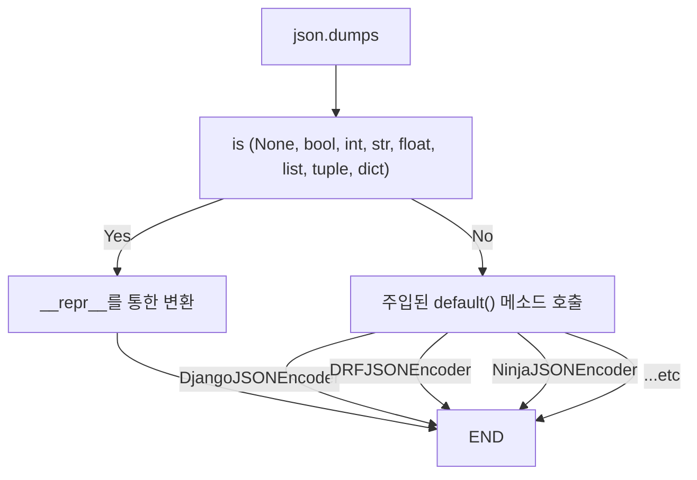

# JSON Serializer 
Python 을 다루면서 프로젝트를 하게 되면 JSON을 Binary 형태로 변환하거나, 혹은 그 반대의 작업을 해야 하는 경우는 필연적으로 발생하게 됩니다. 기본적인 타입(`Primitive type`)들은 자연스럽게 변환을 할 수 있지만, 우리가 실제로 작성하게 되는 클래스들은 그렇지 못한 경우가 대부분 입니다. 

이번 게시글에서는 Python이 어떤 과정을 통해서 타입을 JSON 형태로 변환하게 되는 지 살펴보려고 합니다. 

## JSON 모듈 
Python 자체에 내재되어 있으며, 가장 많이 사용되는 `json` 모듈입니다. 주된 사용법은 이렇습니다. 

### Serialize
```python
>>> json.dumps(dict(text="hello world"))
'{"text": "hello world"}'
```

### Deserialize
```python
>>> json.loads('{"text": "hello world"}')
{'text': 'hello world'}
```

`json.dumps` 내부에서는 어떻게 데이터들을 처리하고 있을까요? 

먼저 [내부 코드](https://github.com/python/cpython/blob/fc897fcc01964649f023e0baa4c95d142e4e8a10/Lib/json/__init__.py#L183)를 살펴보면 기본적으로 `JSONEncoder`를 호출하고 있음을 살펴볼 수 있습니다. 
```python
 if cls is None:
        cls = JSONEncoder
    return cls(
        skipkeys=skipkeys, ensure_ascii=ensure_ascii,
        check_circular=check_circular, allow_nan=allow_nan, indent=indent,
        separators=separators, default=default, sort_keys=sort_keys,
        **kw).encode(obj)

```

그럼 이 `JSONEncoder`는 정확히 어떻게 동작하는 걸까요? 
똑같이 [내부 코드](https://github.com/python/cpython/blob/fc897fcc01964649f023e0baa4c95d142e4e8a10/Lib/json/encoder.py#L423)를 타고타고 들어가 핵심 변환 로직은 이렇게 작성되어 있습니다. 
```python
if isinstance(o, str):
	yield _encoder(o)
elif o is None:
	yield 'null'
elif o is True:
	yield 'true'
elif o is False:
	yield 'false'
elif isinstance(o, int):
	# see comment for int/float in _make_iterencode
	yield _intstr(o)
elif isinstance(o, float):
	# see comment for int/float in _make_iterencode
	yield _floatstr(o)
elif isinstance(o, (list, tuple)):
	yield from _iterencode_list(o, _current_indent_level)
elif isinstance(o, dict):
	yield from _iterencode_dict(o, _current_indent_level)
```
- `None` 과 `boolean` 타입은 단순하게 보이실겁니다. 
- `int` 타입은 `_intstr=int.__repr__` 로 정의되어 있어 `__repr__` 를 참조하고 있습니다.
- `float`은 [별도 정의된 함수](https://github.com/python/cpython/blob/fc897fcc01964649f023e0baa4c95d142e4e8a10/Lib/json/encoder.py#L224) 에서 처리하며 마찬가지로 `__repr__` 를 참조하고 있습니다.
- `list`와 `tuple`은 [요소를 순회](https://github.com/python/cpython/blob/fc897fcc01964649f023e0baa4c95d142e4e8a10/Lib/json/encoder.py#L278)하며 각각의 타입마다 똑같이 `__repr__`를 참조하고 있습니다.
-  `dict`도 마찬가지로 각각의 [요소를 순회](https://github.com/python/cpython/blob/fc897fcc01964649f023e0baa4c95d142e4e8a10/Lib/json/encoder.py#L337C9-L337C25) 하며 각각의 타입마다 `__repr__`를 참조하고 있습니다. 

한가지 더 중요하게 봐야하는 점은, `else` 구문입니다.  
```python
else:
	if markers is not None:
		markerid = id(o)
		if markerid in markers:
			raise ValueError("Circular reference detected")
		markers[markerid] = o
	newobj = _default(o)
```
코드에 마지막에보면 `new_obj = _default(o)` 라고 해서 `_default` 메소드를 호출하는데, 이 메소드는  `json.dumps` 의 매개변수에 주입할 수 있는 메소드입니다. JSONEncoder의 [default 메소드의 설명](https://github.com/python/cpython/blob/fc897fcc01964649f023e0baa4c95d142e4e8a10/Lib/json/encoder.py#L161)을 보면 상속 받아서 타입에 적합한 Serialize 방식을 새로 정의하라고 적혀있습니다. 
 

 요약을 하자면, `json` 모듈은 기본 자료형에 대해서만 Serialization 을 지원합니다. 
 - 호환되는 기본 자료형: **bool, None, int, float, list, tuple, dict**
 - 호환되지 않는 자료형은 먼저 `default()` 메소드를 호출하여 시도합니다. 
 - `Enum` 은 기본적으로 지원하지 않습니다. 
 - `datetime` 또한 지원하지 않습니다. 

## DjangoJSONEncoder 
Django나 DRF 에서 가장 기본으로 사용하는 `Encoder` 입니다. 

[내부 코드](https://github.com/django/django/blob/fd1dd767783b5a7ec1a594fcc5885e7e4178dd26/django/core/serializers/json.py#L77)를 보면 `json.JSONEncoder` 를 상속받고 `default()` 메소드를 간단하게 구현한 것을 확인할 수 있습니다. 해당 코드를 살짝 살펴 보면 `datetime`에 대해서 추가적인 Serialize 방법을 제공하고 있음을 확인하실 수 있습니다. 그리고 해당되는 타입이 없다면 `super().default(o)` 를 통해서 상위 메소드에 변환을 위임하고 있네요. 
```python
if isinstance(o, datetime.datetime):
	r = o.isoformat()
		if o.microsecond:
			r = r[:23] + r[26:]
		if r.endswith("+00:00"):
			r = r.removesuffix("+00:00") + "Z"
	return r
elif isinstance(o, datetime.date):
	return o.isoformat()
elif isinstance(o, datetime.time):
	if is_aware(o):
		raise ValueError("JSON can't represent timezone-aware times.")
	r = o.isoformat()
	if o.microsecond:
		r = r[:12]
	return r
elif isinstance(o, datetime.timedelta):
	return duration_iso_string(o)
elif isinstance(o, (decimal.Decimal, uuid.UUID, Promise)):
	return str(o)
else:
	return super().default(o)
```

요약하자면 다음과 같습니다. 
- 기본 자료형은 `JSONEncoder`에서 처리합니다. 
- `datetime`은 `_default`를 통해서 처리되는데, `DjangoJSONEncoder`가 이를 구현했습니다. 
-  모델 정의 및 쿼리에 사용되는 `BaseModel`이나 `Queryset`은  지원되지 않습니다. 
- 마찬가지로 `Enum`은 지원되지 않습니다. 


## DRF JSONEncoder 
DRF은 Django의 확장판이라고도 불리고, 사실상 요즘은 DRF로 많이 사용되고 있는 것 같습니다. 
여기도 마찬가지로 [내부 코드](https://github.com/encode/django-rest-framework/blob/f593f5752c45e06147231bbfd74c02384791e074/rest_framework/utils/encoders.py#L24) 를 보시면 `Django` 보다 더 다양한 타입들을 직렬화 하는 것을 보실 수 있습니다. 

대표적으로 추가되는 항목들은 다음과 같습니다. 
```python 
elif isinstance(obj, QuerySet):
	return tuple(obj)
elif isinstance(obj, bytes):
	# Best-effort for binary blobs. See #4187.
	return obj.decode()
elif hasattr(obj, 'tolist'):
	# Numpy arrays and array scalars.
	return obj.tolist()
elif (coreapi is not None) and isinstance(obj, (coreapi.Document, coreapi.Error)):
	raise RuntimeError(
		'Cannot return a coreapi object from a JSON view. '
		'You should be using a schema renderer instead for this view.'
	)
elif hasattr(obj, '__getitem__'):
	cls = (list if isinstance(obj, (list, tuple)) else dict)
	with contextlib.suppress(Exception):
		return cls(obj)
elif hasattr(obj, '__iter__'):
	return tuple(item for item in obj)
return super().default(obj)
```
보시면 `QuerySet`부터, `bytes` 심지어 메소드를 인식하고 적절한 메소드를 호출하는 로직까지 들어가 있습니다. 

## Ninja JSONEncoder
Ninja는 Django의 또 다른 버전입니다. Ninja 는 내부적으로 `Pydantic`을 이용하는데, Ninja 에서는 `Pydanitc`에 대한 Serialize 수단을 추가로 제공합니다. 

마찬가지로 [내부 코드](https://github.com/vitalik/django-ninja/blob/f6edd049d6ae74b76473018c65e29f0deceade88/ninja/responses.py#L20)를 보면 `BaseModel` 에 대한 처리가 되어 있는 것을 확인하실 수 있습니다. 
```python
class NinjaJSONEncoder(DjangoJSONEncoder):
    def default(self, o: Any) -> Any:
        if isinstance(o, BaseModel):
            return o.model_dump()
        if isinstance(o, (IPv4Address, IPv6Address)):
            return str(o)
        if isinstance(o, Enum):
            return str(o)
        return super().default(o)
```

`Ninja`는 `Enum`을 같이 처리하고 있습니다. 하지만 단순히 `str`처리만 하고 있기 때문에 직렬화 수단으로는 부족한 면이 있습니다. 

## 정리

