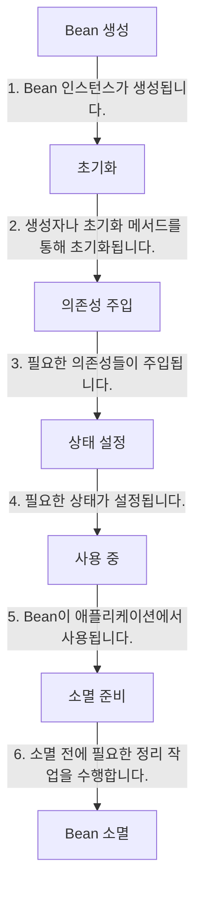
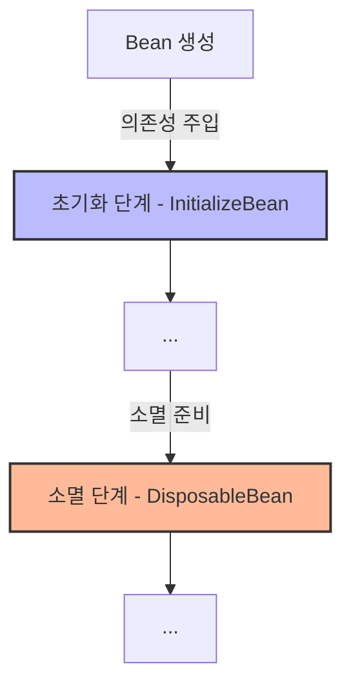
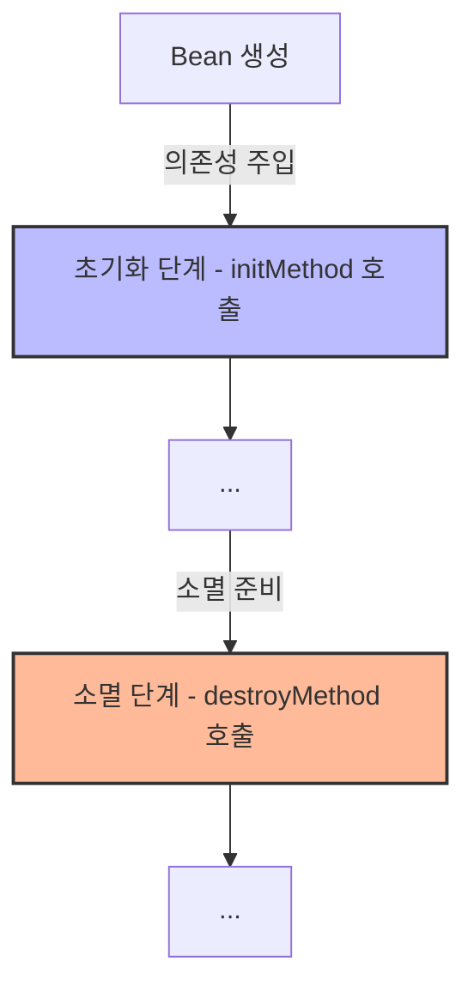
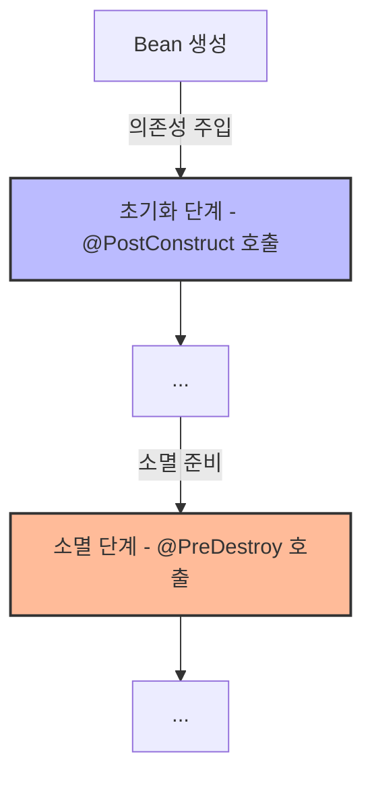

# Bean Lifecycle 
[[Bean]]의 생명주기를 의미합니다. 즉, 언제 Bean이 생성되고 언제 Bean이 제거되는 지를 의미합니다.

먼저 정의된 Bean은 다음과 같은 생명 주기를 가지게 됩니다. 핵심은, **객체를 생성하는 과정과 의존성을 주입하는 과정이 분리되어 있다는 것**입니다. 그렇기 때문에 객체 생성을 위한 책임과 초기화를 위한 책임을 분리하는 것이 적절하다고 합니다. (아직까지는 그렇게 명확하게 와닿지는 않습니다😅)


# Lifecycle callbacks 
이렇게 여러 단계를 가지는 생명주기에서 프로그래머가 직접 접근할 수 있는 Lifecycle callback 을 제공합니다. 쉽게 표현하면, **초기화/소멸 과정 사이에 프로그래머의 코드를 직접 넣을 수 있다는 것** 입니다. 

## InitializeBean, DisposableBean 
가장 **초창기에 정의된 인터페이스**입니다. 각각 초기화, 소멸 단계에서의 Callback을 제공하게 됩니다.



인터페이스를 상속 받아 Callback 을 활용할 수 있다는 점이 장점이지만, **Spring 코드에 의존한다는 점**, **초기화/소멸 메소드를 변경할 수 없다는 점**, 그리고 **코드를 수정할 수 없는 외부 라이브러리에서는 응용할 수 없다는 점**이 치명적이기에 실제로 사용되지는 않습니다.
- 출처 : [Gitlab | NetworkClient.kt](https://gitlab.com/kyudo.hwang/spring-core/-/blob/d0d3ba653f3bf6f39c83ff4288189124bf4baae8/src/test/kotlin/hello/core/lifecycle/NetworkClient.kt)
```kotlin
class NetworkClient: InitializingBean, DisposableBean {
    var url: String? = null

    /*
     *  ....
     */
     
    override fun afterPropertiesSet() {
        // 의존관계 주입이 끝나면 호출
        connect()
        call("afterPropertiesSet")
    }
    override fun destroy() {
        // 빈이 종료될 때 호출
        disconnect()
    }
}
```


## @Bean 을 이용한 Callback 
이 전의 단점을 극복하기 위해, [[Bean|@Bean]]을 정의하는 과정에서 **생성자/소멸자 함수를 직접 명시**하게 됩니다. 전과 같이 호출되는 시점은 크게 다르지 않습니다.



- 출처 : [Gitlab | NetworkClient.kt](https://gitlab.com/kyudo.hwang/spring-core/-/blob/ce468c08ad63c72e3162c8b508d934f5c57bc2a7/src/test/kotlin/hello/core/lifecycle/NetworkClient.kt)
```kotlin showLineNumbers {2, 15, 20}
// Configuration 
@Bean(initMethod = "init", destroyMethod = "close")
fun networkClient(): NetworkClient {
	// ...
}

// NetworkClient
class NetworkClient {
    var url: String? = null

    /*
     *  ....
     */
     
    fun init() {
        // 의존관계 주입이 끝나면 호출
        connect()
        call("afterPropertiesSet")
    }
    fun close() {
        // 빈이 종료될 때 호출
        disconnect()
    }
}
```

> Spring also supports inference of destroy methods, detecting a public `close` or `shutdown` method.

`destroyMethod`를 정의하지 않더라도, 기본적으로 `close`, `shutdown` 메소드를 탐색하여 해당 메소드를 호출하게 됩니다. 

>  it automatically matches `java.lang.AutoCloseable` or `java.io.Closeable` implementations

이게 무언가 Tricky한 구현이 아니라, 인터페이스의 구현체와의 이름과 같기 때문입니다. 
마찬가지로 `initMethod`도 기본으로 정의된 이름을 찾아나서는데, 더 자세한 내용은 [요기](https://docs.spring.io/spring-framework/reference/core/beans/factory-nature.html#beans-factory-lifecycle-default-init-destroy-methods)를 ㅎ.. 

https://github.com/spring-projects/spring-framework/blob/8d707eb5304e42babe3d680c5cd3880869cfabe2/spring-beans/src/main/java/org/springframework/beans/factory/xml/BeanDefinitionParserDelegate.java#L620
## @PostConstruct, @PreDestory 
가장 자연스러운 방식으로 현재까지 추천되는 방식입니다. Annotation 기반으로 제어할 수 있기 때문에 편리하고[[Spring Component|@Component]]과 Annotation 기반 제어에 자연스럽게 적용할 수 있습니다.



- 출처 : [Gitlab | NetworkClient.kt](https://gitlab.com/kyudo.hwang/spring-core/-/blob/4aaa498847504659d9c12aae00d75bfc316604d8/src/test/kotlin/hello/core/lifecycle/NetworkClient.kt)
```kotlin showLineNumbers {9, 16}
// NetworkClient
class NetworkClient {
    var url: String? = null

    /*
     *  ....
     */

    @PostConstruct
    fun constructer() {
        // 의존관계 주입이 끝나면 호출
        connect()
        call("afterPropertiesSet")
    }

	@PreDestroy
    fun destroyer() {
        // 빈이 종료될 때 호출
        disconnect()
    }
}
```

해당 방법은 수정이 어려운 **외부 라이브러리에는 적용이 불가능**하지만, Java 표준으로 등록되었기 때문에 **타 컨테이너 기반 프레임워크와의 호환성을 고려한다면 가장 강력히 추천되는 방식**입니다.


# Reference 
- [인프런 - 스프링 핵심 원리 기본편 | 섹션 8](https://www.inflearn.com/course/%EC%8A%A4%ED%94%84%EB%A7%81-%ED%95%B5%EC%8B%AC-%EC%9B%90%EB%A6%AC-%EA%B8%B0%EB%B3%B8%ED%8E%B8/dashboard)
- [Spring.io | Customizing the Nature of a Bean](https://docs.spring.io/spring-framework/reference/core/beans/factory-nature.html)
- [Srping.io | Using the @Bean Annotation](https://docs.spring.io/spring-framework/reference/core/beans/java/bean-annotation.html#beans-java-lifecycle-callbacks)