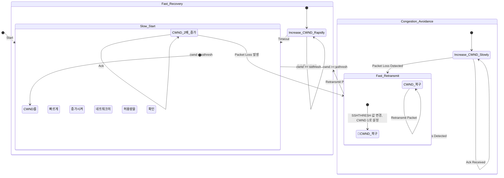

# TCP Congestion Control
[[../Network/OSI Reference Model/Transport Layer/TCP/TCP Flow Control|흐름 제어]]는 수신자의 여유에 맞추어 데이터의 양을 조절하는 방법인 반면에, 혼잡 제어는 **네트워크 상황에 맞추어 데이터의 양을 조절하는 방법**입니다. 네트워크 상황을 알기 위해서는 무언가 단서가 필요한데, [[../Network/OSI Reference Model/Transport Layer/TCP/TCP Header|TCP Header]]에는 이를 알려줄만한 내용이 별도로 없습니다. 따라서, **혼잡 제어는  호스트가 스스로 조절(`self-clocking`)** 하는 방식을 사용하고 있습니다. 이를 조절하는 필드를 `Congestion Window`, 줄여서 `cwnd` 라고 부르곤 합니다

스스로 조절하기 위한 단서로, `Packet Loss`를 사용하게 됩니다. 예를 들어 8byte를 전송하고 적합한 ACK를 받았다면 그 다음에는 8byte 이상의 데이터를, 만약 적합하지 않은 ACK를 받았다면(`Packet loss`) 8byte 보다 작은 데이터를 보내는 방식입니다. 

## TCP Slow Start 
TCP Slow Start 방식은 데이터의 양을 2배씩 늘려나가는 방식입니다. 처음에는 1 Segment 단위로 시작하고, 점차 늘려나가다가 `Packet Loss`가 발생하게 되면 네트워크의 혼잡도를 가정하여 데이터의 전송량을 조절하게 됩니다. 

![[../Network/OSI Reference Model/Transport Layer/TCP/assets/tcp-slow-start.excalidraw.light.png]]
여기서 말씀드린 단위(`Segment`)가 `Congestion Window`를 의미합니다. 1, 2, 4, 8... `cwnd`는 무한정 증가하지 않습니다. Slow Start Threshhold(이하 `ssthresh`)보다 이하의 값까지만 증가를 허용하게 됩니다. 

## Slow Start Threshhold 
`cwnd`와 `ssthresh`는 크게 3가지 상황이 발생할 수 있는데요.

### 1.  $cwnd \lt ssthresh$인 상황에서 Packet Loss가 발생한 경우 
최악의 상황이라고 볼 수 있습니다. 별로 보내지도 않았는데 네트워크가 혼잡 상황이 되어버린 것이죠. 이러한 상황에서는 `cwnd`가 다음과 같이 변화합니다. 
- `ssthresh`의 값은 `cwnd`의 절반으로 줄어들게 됩니다. 
- `cwnd`의 값은 1로 돌아와 다시 Slow Start를 시작하게 됩니다. 

### 2.  $cwnd \lt ssthresh$인 상황에서 아무런 Loss가 발생하지 않은 경우
아직 쾌적하다고 볼 수 있습니다. Slow Start에 따라 `cwnd`의 값이 2배씩 증가하게 됩니다. 

## 3. $cwnd \ge ssthresh$ 인 상황인 경우 
쾌적하지만 `ssthresh`를 넘어버렸습니다. 즉, **여기 이상을 보내게 되면 혼잡 상황이 발생한다는 것을 경험적으로 알고 있습니다.** 이 때는 2배씩 증가하는 Slow Start를 중지하고, 혼잡 회피(Congestion Avoidance) 단계로 넘어오게 됩니다. 

- Congestion Avoidance : 별도의 Packet loss가 발생하기 전까지 `cwnd`의 크기를 1씩 증가. 

## State Diagram 

